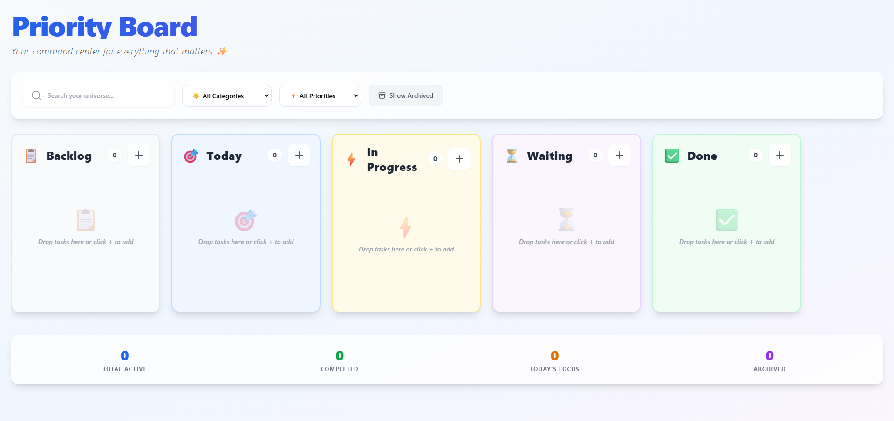

# 📋 Priority Board - A Vanilla JS Kanban Task Manager

[](https://opensource.org/licenses/MIT)
[](https://mrutyunjay-patil.github.io/priority-board/)
[](https://github.com/Mrutyunjay-Patil/priority-board)

Your command center for everything that matters ✨

Priority Board is a fully-featured, offline-first Kanban board application built with pure HTML, CSS, and Vanilla JavaScript. It was converted from an original React application to demonstrate that a rich, interactive user experience can be achieved without relying on front-end frameworks.

---

### 🚀 [Live Demo](https://mrutyunjay-patil.github.io/priority-board/) 🚀

---


<!-- 
**Note for developer:** 
1. Take a screenshot of the application.
2. Add it to your repository with the name `screenshot.png`.
3. The image will automatically appear here.
-->

## ✨ Features

-   **Modern & Clean UI**: Aesthetically pleasing interface built with Tailwind CSS.
-   **Full CRUD Functionality**: Create, Read, Update, and Delete tasks seamlessly.
-   **↔️ Drag & Drop**: Intuitively move tasks between columns (`Backlog`, `Today`, `In Progress`, `Waiting`, `Done`).
-   **💾 Persistent State**: Your tasks are automatically saved to your browser's Local Storage, so your data is safe even after a refresh.
-   **🔍 Powerful Filtering & Search**:
    -   Search tasks by title or description.
    -   Filter tasks by category (Work, Personal, etc.).
    -   Filter tasks by priority (High, Medium, Low).
-   **📦 Task Archiving**: Archive completed tasks to keep your board clean while preserving history.
-   **📊 Stats Dashboard**: Get a quick overview of your productivity with stats for active, completed, today's, and archived tasks.
-   **📱 PWA Ready (Progressive Web App)**:
    -   **Installable**: Install the app on your desktop or mobile device for a native-like experience.
    -   **Offline Access**: The app caches its shell and works offline thanks to a Service Worker.
-   **🚀 Zero Dependencies**: Written in pure Vanilla JavaScript. No frameworks, no build steps. Just one HTML file.
-   **📱 Responsive Design**: Looks and works great on all devices, from mobile phones to desktops.

## 🛠️ Tech Stack

This project was built using only fundamental web technologies:

-   **HTML5**: For the core structure and content.
-   **Tailwind CSS**: Used via a CDN for modern, utility-first styling.
-   **Vanilla JavaScript (ES6+)**: For all the application logic, state management, event handling, and DOM manipulation.
-   **Lucide Icons**: For clean and beautiful icons, loaded via a CDN.
-   **Web APIs**: Leverages browser APIs like `Local Storage`, `Service Worker`, and the `beforeinstallprompt` event for PWA features.

## 🏁 Getting Started

Running this project locally is incredibly simple.

1.  **Clone the repository:**
    ```sh
    git clone https://github.com/Mrutyunjay-Patil/priority-board.git
    ```

2.  **Navigate to the project directory:**
    ```sh
    cd priority-board
    ```

3.  **Open the `index.html` file in your favorite browser.**
    -   On macOS: `open index.html`
    -   On Windows: `start index.html`
    -   Or simply double-click the file in your file explorer.

That's it! There are no dependencies to install or build steps to run.

## 🤝 Contributing

Contributions are welcome! If you have ideas for new features, bug fixes, or improvements, please feel free to contribute.

1.  **Fork** the repository.
2.  Create a new branch (`git checkout -b feature/YourAmazingFeature`).
3.  Make your changes.
4.  Commit your changes (`git commit -m 'Add some AmazingFeature'`).
5.  Push to the branch (`git push origin feature/YourAmazingFeature`).
6.  Open a **Pull Request**.

You can also open an **issue** to report a bug or suggest a feature.

## 📄 License

This project is licensed under the MIT License. See the [LICENSE](LICENSE) file for details.

```
MIT License

Copyright (c) 2023 Mrutyunjay Patil

Permission is hereby granted, free of charge, to any person obtaining a copy
of this software and associated documentation files (the "Software"), to deal
in the Software without restriction, including without limitation the rights
to use, copy, modify, merge, publish, distribute, sublicense, and/or sell
copies of the Software, and to permit persons to whom the Software is
furnished to do so, subject to the following conditions:

The above copyright notice and this permission notice shall be included in all
copies or substantial portions of the Software.

THE SOFTWARE IS PROVIDED "AS IS", WITHOUT WARRANTY OF ANY KIND, EXPRESS OR
IMPLIED, INCLUDING BUT NOT LIMITED TO THE WARRANTIES OF MERCHANTABILITY,
FITNESS FOR A PARTICULAR PURPOSE AND NONINFRINGEMENT. IN NO EVENT SHALL THE
AUTHORS OR COPYRIGHT HOLDERS BE LIABLE FOR ANY CLAIM, DAMAGES OR OTHER
LIABILITY, WHETHER IN AN ACTION OF CONTRACT, TORT OR OTHERWISE, ARISING FROM,
OUT OF OR IN CONNECTION WITH THE SOFTWARE OR THE USE OR OTHER DEALINGS IN THE
SOFTWARE.
```

## 📬 Contact

Mrutyunjay Patil

-   **GitHub**: [@Mrutyunjay-Patil](https://github.com/Mrutyunjay-Patil)
-   **Email**: [patilmrutyunjay2@gmail.com](mailto:patilmrutyunjay2@gmail.com)

---
